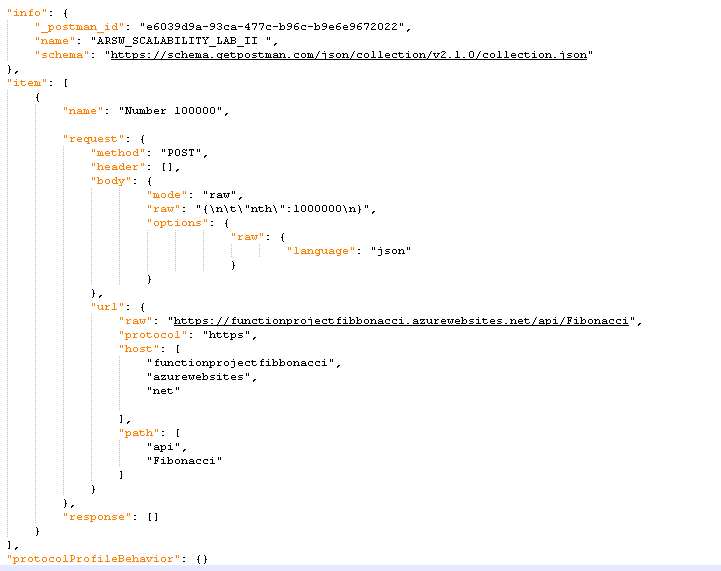
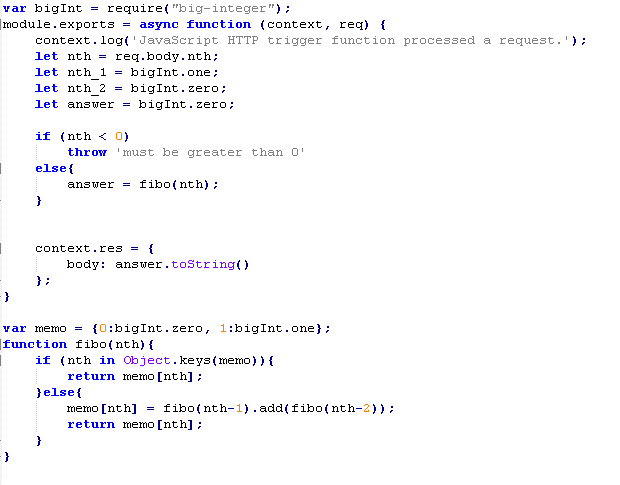

### Escuela Colombiana de Ingeniería
### Arquitecturas de Software - ARSW

## Escalamiento en Azure con Maquinas Virtuales, Sacale Sets y Service Plans

### Dependencias
* Cree una cuenta gratuita dentro de Azure. Para hacerlo puede guiarse de esta [documentación](https://azure.microsoft.com/en-us/free/search/?&ef_id=Cj0KCQiA2ITuBRDkARIsAMK9Q7MuvuTqIfK15LWfaM7bLL_QsBbC5XhJJezUbcfx-qAnfPjH568chTMaAkAsEALw_wcB:G:s&OCID=AID2000068_SEM_alOkB9ZE&MarinID=alOkB9ZE_368060503322_%2Bazure_b_c__79187603991_kwd-23159435208&lnkd=Google_Azure_Brand&dclid=CjgKEAiA2ITuBRDchty8lqPlzS4SJAC3x4k1mAxU7XNhWdOSESfffUnMNjLWcAIuikQnj3C4U8xRG_D_BwE). Al hacerlo usted contará con $200 USD para gastar durante 1 mes.

### Parte 0 - Entendiendo el escenario de calidad

Adjunto a este laboratorio usted podrá encontrar una aplicación totalmente desarrollada que tiene como objetivo calcular el enésimo valor de la secuencia de Fibonnaci.

**Escalabilidad**
Cuando un conjunto de usuarios consulta un enésimo número (superior a 1000000) de la secuencia de Fibonacci de forma concurrente y el sistema se encuentra bajo condiciones normales de operación, todas las peticiones deben ser respondidas y el consumo de CPU del sistema no puede superar el 70%.

### Escalabilidad Serverless (Functions)

1. Cree una Function App tal cual como se muestra en las  imagenes.

2. Instale la extensión de **Azure Functions** para Visual Studio Code.

3. Despliegue la Function de Fibonacci a Azure usando Visual Studio Code. La primera vez que lo haga se le va a pedir autenticarse, siga las instrucciones.

4. Dirijase al portal de Azure y pruebe la function.

5. Modifique la coleción de POSTMAN con NEWMAN de tal forma que pueda enviar 10 peticiones concurrentes. Verifique los resultados y presente un informe.

6. Cree una nueva Function que resuleva el problema de Fibonacci pero esta vez utilice un enfoque recursivo con memoization. Pruebe la función varias veces, después no haga nada por al menos 5 minutos. Pruebe la función de nuevo con los valores anteriores. ¿Cuál es el comportamiento?.

**Preguntas**

* ¿Qué es un Azure Function?

  Azure Function es una solución para ejecutar fácilmente pequeños fragmentos de código o “funciones” en la nube. Toma los 
  conceptos básicos de los ya conocidos WebJobs y los amplía de forma interesante.

* ¿Qué es serverless?
  
  La computación sin servidor (o serverless para abreviar) es un modelo de ejecución en el que el proveedor en la nube 
  (AWS,  Azure o Google Cloud) es responsable de ejecutar un fragmento de código mediante la asignación dinámica de 
  los recursos. Y cobrando solo por la cantidad de recursos utilizados para ejecutar el código. El código, generalmente, 
  se ejecuta dentro de contenedores sin estado que pueden ser activados por una variedad de eventos que incluyen 
  solicitudes HTTP, eventos de base de datos, servicios de colas, alertas de monitoreo, carga de archivos, eventos 
  programados (trabajos cron), etc. El código que se envía a al proveedor en la nube para la ejecución es generalmente en 
  forma de una función. Por lo tanto, serverless a veces se denomina “Funciones como servicio” o “FaaS”.

* ¿Qué es el runtime y que implica seleccionarlo al momento de crear el Function App?

  Una Functions App se ejecuta en una versión específica  de Azure Functions runtime. Hay tres versiones principales: 
  1.x, 2.xy 3.x. Por defecto, las Functions App se crean en la  versión 2.x de runtime.
  
  Azure Functions le permite segmentar una versión específica del runtime mediante el uso de la configuración de la 
  aplicación FUNCTIONS_EXTENSION_VERSION en una Function App. La Function App se mantiene en la versión principal 
  especificada hasta que elija explícitamente pasar a una nueva versión.

* ¿Por qué es necesario crear un Storage Account de la mano de un Function App?

  La Storage Account de azure le permite a Function App  manejar funciones automaticas y ejecutar el almacenamiento de registros. Utiliza las funciones de Blobs, tables y queues para mantener una flexibilidad de escalamiento y una comunicacion de la aplicacion mas confiable.

* ¿Cuáles son los tipos de planes para un Function App?, ¿En qué se diferencias?, mencione ventajas y desventajas de cada uno de ellos.

|         Recurso         |    Consumption    |      Premium      |     Dedicated     |
|:-----------------------:|:-----------------:|:-----------------:|:-----------------:|
|        Scale out        | Manejador eventos | Manejador eventos | Escalamiento automatico o manual |
| Max tamaño peticion(MB) |        100        |        100        |        100        |
|     Max memoria(GB)     |        1.5        |      3.5 - 14     |     1.75 - 14     |
|  Function Apps por plan |        100        |        100        |     Sin limite    |
|      Almacenamiento     |        1GB        |       250GB       |    50 - 1000GB    |
  Consumption: Es el plan mas economico tiene facturacion por tiempo de ejecucion, cantidad de ejecuciones y memoria usada.

  Premium: Presenta mayores ventajas en cuanto a recursos, evita inicios desde 0, conexion con red virtual, prediccion de precios.

  Dedicated: Permite un mayor control sobre la aplicaicon y los recursos ya sea para mantener un escalamiento grande o para abajo. Tiene cion de mantener siempre arriba. 

* ¿Por qué la memoization falla o no funciona de forma correcta?
* ¿Cómo funciona el sistema de facturación de las Function App?

El sistema de facturacion esta dada por la cantidad de ejecuciones, el tiempo de ejecucion y la cantidad de memoria utilizada. 
* Informe
